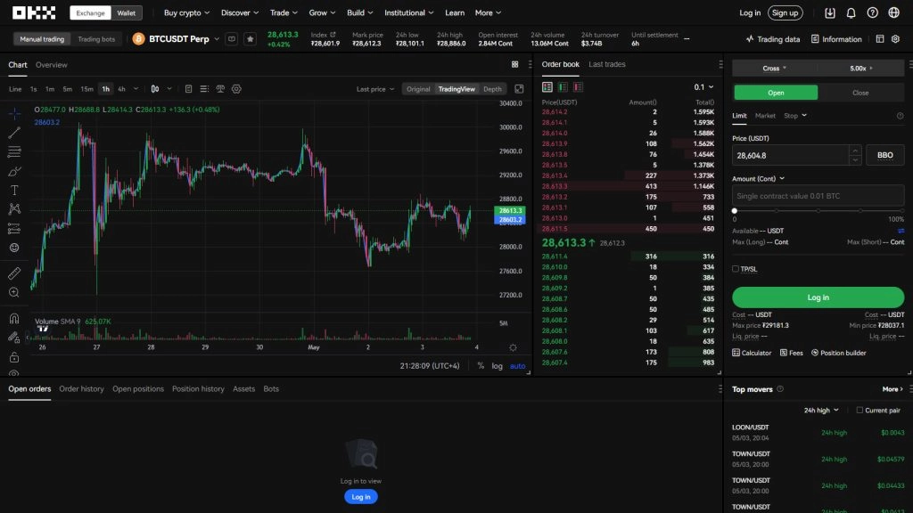

# OKX全面评测：加密货币交易者的完整指南

OKX作为全球领先的加密货币交易平台，为交易者提供了从现货到衍生品的完整交易生态。无论你是刚入门的新手，还是寻找高级交易工具的专业玩家，这个平台都能满足你的需求。它支持多种交易方式，包括现货、期货和永续合约，还提供自动化交易机器人等创新功能。

---

## OKX交易所简介

OKX成立于2017年，已经发展成为提供全方位金融服务的加密货币交易平台。它不只是一个简单的买卖场所，更像是一个综合性的数字资产管理中心。你可以在这里进行现货交易、期货交易、永续合约交易，甚至参与质押赚币等多种投资方式。

## OKX核心功能一览

**现货交易**

现货交易是最基础也是最直接的交易方式。你可以按当前市场价格买入或卖出加密货币。OKX支持大量的交易对，界面设计对各个水平的交易者都很友好。👉 [立即体验OKX现货交易，开启你的加密货币投资之旅](https://www.okx.com/join/62834398)

**期货交易**

期货交易让你可以对加密货币的未来价格进行投机。无论市场上涨还是下跌，你都有机会通过做多或做空来获利。这种灵活性是期货交易的最大魅力。

**永续合约**

永续合约是OKX提供的一种特殊衍生品，和期货类似但没有到期日。你可以无限期持有合约，这对于想要长期持有某个仓位的交易者来说非常方便。

**交易机器人**

OKX内置了交易机器人功能，可以帮你自动执行交易策略。你可以选择预设的策略，也可以根据自己的需求定制。这对于没时间盯盘或者想要24小时执行策略的人来说特别有用。

**跟单交易**

如果你对自己的交易技巧还不够自信，可以试试跟单交易。通过复制平台上经验丰富交易者的操作，你可能会提升自己的交易表现。这是个学习的好方法，同时也能获得潜在收益。

**质押和理财**

除了交易，OKX还提供多种理财方式。你可以通过质押、流动性挖矿、借贷等方式让持有的加密货币增值。这些选项让你的资产不会闲置，而是能产生额外收益。

## 如何开始使用OKX

**注册账户**

注册过程很简单。访问OKX官网，输入你的邮箱或手机号，设置一个安全的密码，就可以创建账户了。

**启用双重验证**

双重验证(2FA)是保护账户安全的关键。OKX支持短信验证和应用验证两种方式。强烈建议你开启这个功能，给账户加一层保护。

**充值和提现**

账户设置好后，你就可以充值了。OKX支持多种充值方式，包括加密货币转账、银行转账和信用卡/借记卡。提现的流程也很直观。

## OKX交易界面详解

**定制你的仪表盘**

OKX的交易界面可以高度定制。你可以根据自己的交易习惯调整仪表盘布局，把最常用的功能放在最方便的位置。

**订单类型说明**

平台提供多种订单类型，包括限价单、市价单和止损单。这些工具可以帮你更精确地执行交易策略。

**技术分析工具**

OKX集成了丰富的技术分析工具。移动平均线、RSI等常用指标都可以直接使用，帮你做出更明智的交易决策。

## 费用结构和交易限额

**OKX费用体系**

OKX的费用在行业内很有竞争力。现货交易的挂单和吃单手续费都从0.1%起。提现和充值费用会根据具体的加密货币有所不同。

**理解挂单和吃单费用**

挂单费是指你提供流动性时收取的费用，吃单费是指你从订单簿中移除流动性时的费用。通常挂单费会更低一些。

**大额交易者的阶梯优惠**

如果你的交易量大，OKX会根据你30天的交易量和OKB代币持有量提供费用折扣。对于高频交易者来说，这能节省不少成本。

## OKX高级交易选项

**杠杆交易**

杠杆交易允许你借入资金来扩大交易规模。这能放大潜在收益，但同时也会增加风险。使用前一定要充分了解杠杆的机制。

**全仓和逐仓模式**

OKX支持全仓和逐仓两种模式。全仓模式下，账户中的所有可用余额都会用作保证金；逐仓模式则只使用分配给特定仓位的保证金。后者能更好地控制风险。

**使用杠杆交易**

杠杆能让你用较小的资金获得较大的市场敞口。OKX根据不同产品和用户风险承受能力提供不同的杠杆倍数。👉 [探索OKX杠杆交易，发现更多盈利可能](https://www.okx.com/join/62834398)

## API集成和交易机器人

**访问OKX API**

OKX提供了完善的API接口，开发者和交易者可以用它来构建自定义的交易应用、机器人和集成工具。

**选择合适的交易机器人**

选择交易机器人时，要考虑易用性、定制化选项、支持的交易所以及历史表现等因素。一个好的机器人应该能适应你的交易风格。

## OKX交易机器人解决方案

**Hinvest.ai介绍**

Hinvest.ai是一个先进的交易机器人解决方案，能与OKX无缝集成。它提供多种可定制的策略和功能，帮你优化交易体验。

**设置Hinvest.ai与OKX集成**

要开始使用Hinvest.ai，你需要在Hinvest.ai网站上创建账户，通过API将其连接到你的OKX账户，然后配置你偏好的交易策略。

**使用交易机器人的好处**

交易机器人能帮你捕捉市场机会，而不需要时刻盯盘。对于想要摆脱情绪化交易的人来说，这是个理想的选择。机器人会严格按照设定的规则执行，不会因为恐惧或贪婪而做出错误决策。

## OKX移动应用

**主要功能和优势**

OKX移动应用提供了流畅的移动交易体验。实时市场数据、交易提醒，以及平台的所有功能都能在手机上使用。无论你在哪里，都能把握交易机会。

**设置移动交易提醒**

你可以直接在OKX移动应用中设置自定义价格提醒和通知。这样当市场出现你关注的变化时，你就能及时收到通知并采取行动。

## 安全和防护措施

**OKX的安全协议**

OKX采用了强大的安全措施，包括SSL加密、冷钱包存储和多重签名钱包，来保护用户的资产和信息。

**冷钱包和多重签名钱包**

大部分用户资金都存储在冷钱包中，与互联网隔离。多重签名钱包则需要多个授权才能执行交易,提供了额外的安全层。

**保险基金保护用户**

OKX维护着一个保险基金，在发生黑客攻击或系统故障等意外事件时保护用户资产。这是平台对用户资金安全承诺的体现。

## 客户支持和资源

**使用OKX帮助中心**

OKX帮助中心提供了丰富的资源，包括指南、教程和常见问题解答，帮助用户解决问题和学习平台功能。

**联系OKX支持团队**

用户可以通过多种渠道联系OKX支持，包括邮件、在线客服和社交媒体，获得个性化的帮助。

**加入OKX社区**

OKX有一个活跃的用户和交易者社区，有专门的论坛和社交媒体渠道供大家分享知识、经验和交易想法。

## OKX的优势与不足

使用OKX进行交易时，了解平台的优势和潜在缺点很重要。

**OKX的优势**

1. **交易选项丰富**：OKX提供全面的加密货币和交易对选择，包括现货、期货和永续合约，让你能分散投资组合并尝试不同策略。

2. **高级交易功能**：杠杆交易、多种订单类型等功能为有经验的交易者提供了更多灵活性和控制力。

3. **界面友好**：无论新手还是老手，都能快速上手。可定制的仪表盘和直观的导航提升了整体体验。

4. **安全措施完善**：冷钱包存储、多重签名钱包和保险基金等措施让人用得放心。

5. **API集成**：API接口允许连接外部应用或交易机器人，实现自动化交易策略。

**潜在不足和注意事项**

1. **地域限制**：OKX不服务某些地区的客户，包括美国、新加坡等。使用前务必确认你所在地区是否支持。

2. **新手可能觉得复杂**：虽然有友好的功能，但丰富的交易选项和高级功能对初学者可能有些overwhelming。需要投入时间学习。

3. **法币支持有限**：虽然支持法币充值,但可用的法币选项会因地区而异。充值或提现前最好先确认。

4. **市场波动性**：加密货币市场的波动性众所周知，既是机会也是风险。交易者必须做好应对价格波动的准备并合理管理风险。

5. **客服响应时间**：虽然提供客户支持，但在高峰期响应时间可能会有延迟。一些用户反映过这个问题。

## OKX与其他交易所对比

选择交易所时，交易费用、支持的加密货币、可用交易对、用户界面、安全措施、客服和合规性都是重要考量因素。以下是OKX与几个主流交易所的简要对比：

**OKX vs Binance**

- OKX和Binance都是成熟可靠的交易所
- Binance支持的加密货币和交易对更多
- OKX提供更多高级交易选项,包括期货和永续合约
- Binance有友好的界面和移动应用，与OKX类似
- OKX为大额交易者提供更低费用,而Binance根据BNB持有量提供阶梯折扣

**OKX vs Bybit**

- Bybit专注于衍生品交易,而OKX提供更广泛的交易选项
- Bybit界面更简单,对新手更友好
- OKX提供现货交易和永续资产选项,Bybit不支持
- Bybit提供的杠杆交易倍数比OKX更高
- 两个交易所都重视安全措施,客服响应都不错

**OKX vs Bitget**

- Bitget也提供现货、期货等多种交易选项
- OKX和Bitget的交易功能类似
- 两个平台都有友好的界面和移动应用
- OKX支持的加密货币和交易对更多
- Bitget某些交易对的费用可能更低,但OKX为大额交易者提供阶梯折扣
- 两个交易所都重视安全,有保护用户资金的措施

对比交易所时,关键是考虑你的具体交易需求、偏好以及哪些功能对你最重要。做好充分研究,了解每个交易所的特点,才能做出明智选择。

---

## 结语

OKX是一个功能全面、特色丰富的加密货币交易平台，适合从新手到专业玩家的各类交易者。凭借高级交易选项、有竞争力的费用结构和完善的安全措施，OKX已经确立了在加密货币领域的领先地位。

选择任何交易所之前，仔细评估其功能、费用和声誉都很重要，确保它符合你的交易目标和风险承受能力。对许多用户来说，OKX强大的功能和友好的平台使其成为交易和投资加密货币的理想选择。最重要的是，这个平台能为各种交易场景提供稳定高效的体验，无论你是想进行简单的现货交易还是复杂的衍生品操作，OKX都能满足需求。👉 [现在就加入OKX，开启你的加密货币交易之旅](https://www.okx.com/join/62834398)
